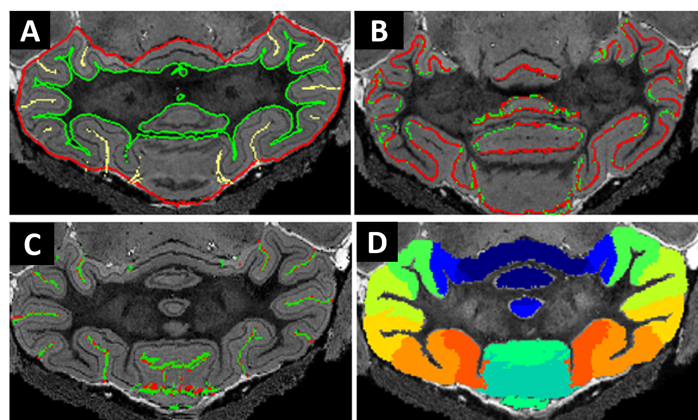

# Tc1 Mouse cerebellum atlas (with Purkinje layer segmentation)

This mouse cerebellar atlas can be used for  mouse cerebellar morphometry

## QuickCheck

## Reference/citation:
- If you're using the this mouse MRI cerebellar atlas in your paper, we ask you to please kindly cite the following papers:
  - Ma, D., Cardoso, M. J., Zuluaga, M. A., Modat, M., Powell, N. M., Wiseman, F. K., Cleary, J. O., Sinclair, B., Harrison, I. F., Siow, B., Popuri, K., Lee, S., Matsubara, J. A., Sarunic, M. V, Beg, M. F., Tybulewicz, V. L. J., Fisher, E. M. C., Lythgoe, M. F., & Ourselin, S. (2020). **Substantially thinner internal granular layer and reduced molecular layer surface in the cerebellum of the Tc1 mouse model of Down Syndrome – a comprehensive morphometric analysis with active staining contrast-enhanced MRI**. NeuroImage, 117271. https://doi.org/https://doi.org/10.1016/j.neuroimage.2020.117271
  - Ma, D., Cardoso, M. J., Zuluaga, M. A., Modat, M., Powell, N., Wiseman, F., Tybulewicz, V., Fisher, E., Lythgoe, M. F., & Ourselin, S. (2015). **Grey Matter Sublayer Thickness Estimation in the Mouse Cerebellum**. In Medical Image Computing and Computer Assisted Intervention 2015 (pp. 644–651). https://doi.org/10.1007/978-3-319-24574-4_77
